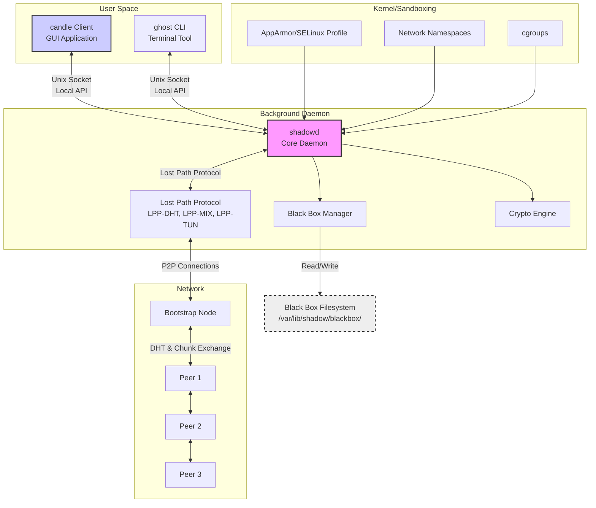

# Shadow-Path-Network (SHPN)

**A Sovereign, Censorship-Resistant Internet Protocol & Network**


## 📖 Table of Contents
1.  [Vision](#-vision)
2.  [How It Works](#-how-it-works)
3.  [System Architecture](#-system-architecture)
4.  [Technical Specifications](#-technical-specifications)
5.  [Development Roadmap](#-development-roadmap)
6.  [Getting Started for Developers](#-getting-started-for-developers)
7.  [Contributing](#-contributing)
8.  [License & Disclaimer](#-license--disclaimer)

---

## 🎯 Vision

Shadow-Path-Network (SHPN) is not an anonymity layer over the old web. It is a **sovereign internet**, built from first principles. It defines a new protocol (`sp:`), a new network topology (decentralized mesh), and a new security model (plausible deniability). There is no HTTP, no DNS, no CA authorities. Access is granted solely by knowledge of a cryptographic hash.

## 🔄 How It Works: The Sovereign Pattern

### For Users:
1.  **Publish:** Drag a file/website into the `candle` client. It returns a `sp:abc123.path` link.
2.  **Share:** Share this link through any trusted channel (email, Signal, etc.). **This link is the key.**
3.  **Access:** Click a `sp:` link. It opens the `candle` client, which finds, decrypts, and renders the content from the distributed network.

### Under the Hood:
1.  Content is encrypted (XChaCha20-Poly1305) and erasure-coded (Reed-Solomon) into chunks.
2.  Chunks are distributed to volunteers' **Black Boxes** via the **Lost Path Protocol**.
3.  Chunk locations are recorded in a Distributed Hash Table (DHT).
4.  Retrieval reverses the process: find chunks via DHT, verify, decrypt, and reassemble.

## 🏗 System Architecture

SHPN is built on a strict client-daemon model for security and modularity.

### Architecture Overview


### Component Details

| Component | Purpose | Tech Stack |
| :--- | :--- | :--- |
| **`shadowd` Daemon** | Core engine. Manages P2P connections, crypto, and the Black Box. Runs sandboxed. | **D语言**, Libsodium (via Deimos), systemd |
| **`candle` Client** | Sovereign GUI application. The user's window into the SHPN. Handles `sp:` links. | **D语言**, GTK/DlangUI, WebKitGTK (for rendering) |
| **`ghost` CLI** | Power user tool for publishing, chat, and node management via terminal. | **D语言** |
| **Lost Path Protocol (LPP)** | Suite of protocols that power the network. | Custom binary protocol over UDP/TCP |
| **Black Box** | Encrypted, isolated storage on a volunteer's disk. Contents are unknowable. | Filesystem sandboxing, LRU cache eviction |

## ⚙️ Technical Specifications

### The `sp:` URL
-   **Format:** `sp:<multihash>[#optional_friendly_name]`
-   **Example:** `sp:z39XiGKSTSWoUqZ3bf5j7xL2aPq9E1FnM8rC#Project_Plan.pdf`
-   The `multihash` is the root key from which all decryption keys for the content's chunks are derived.

### Cryptography
-   **Encryption:** XChaCha20-Poly1305 (via Libsodium)
-   **Hashing:** BLAKE3
-   **Signing:** Ed25519
-   **Erasure Coding:** Reed-Solomon (e.g., 10-of-16)

### Network Protocols (LPP Suite)
-   **LPP-DHT:** Kademlia-based DHT for peer and chunk discovery.
-   **LPP-MIX:** Low-volume, high-latency mixnet for anonymous control messages.
-   **LPP-TUN:** Onion-routed tunnel protocol for high-speed data transfer.

## 🗺️ Development Roadmap

### Phase 0: Research & Specification (Current)
-   [ ] Finalize LPP packet structures in `docs/05-PROTOCOL.md`
-   [ ] Choose & document crypto primitives
-   [ ] Define `.path` URL standard
-   **Deliverable:** `docs/05-PROTOCOL.md` v1.0

### Phase 1: Core Library & CLI (`libshadow`, `ghost`)
-   [ ] `libshadow`: Crypto, chunking, storage management
-   [ ] `ghost` CLI: `publish`, `get`, `status` commands
-   **Deliverable:** Functional CLI for local file sharing.

### Phase 2: The `shadowd` Daemon
-   [ ] Daemon core around `libshadow`
-   [ ] LPP-DHT implementation
-   [ ] Systemd service & sandboxing profiles
-   **Deliverable:** Secure daemon that can join a testnet.

### Phase 3: The `candle` Client
-   [ ] GUI application with built-in renderer
-   [ ] `sp:` protocol handler OS integration
-   [ ] Daemon API integration
-   **Deliverable:** Alpha release. Users can publish and browse.

### Phase 4: Ecosystem
-   [ ] "Lighter" terminal chat
-   [ ] Streaming protocol extensions
-   **Deliverable:** Full-featured v1.0.

## 🚀 Getting Started for Developers

### Prerequisites
-   **D Compiler:** `ldc2` (LLVM D Compiler)
-   **Build Tool:** `dub`
-   **Libsodium:** `libsodium-dev` library

### Build from Source
```bash
# 1. Clone the repository
git clone https://github.com/shadow-path/shadow.git
cd shadow

# 2. Install D dependencies (using dub)
dub update

# 3. Build the project
dub build

# 4. Run tests (once implemented)
dub test
```

### Project Structure
```
shadow/
├── source/
│   ├── shadow/
│   │   ├── app.d         # Main CLI entry point (ghost)
│   │   ├── daemon/
│   │   │   ├── main.d    # shadowd main()
│   │   │   ├── engine.d  # Core daemon logic
│   │   │   └── config.d  # TOML configuration
│   │   ├── core/
│   │   │   ├── crypto.d  # Encryption, hashing (uses Libsodium)
│   │   │   ├── chunker.d # Erasure coding
│   │   │   └── blackbox.d # Black Box storage manager
│   │   ├── protocol/
│   │   │   ├── dht.d     # LPP-DHT implementation
│   │   │   ├── mixnet.d  # LPP-MIX logic
│   │   │   └── tunnel.d  # LPP-TUN logic
│   │   └── utils/
│   │       └── logging.d # Structured logging
├── docs/
│   ├── 01-VISION.md
│   ├── 02-ARCHITECTURE.md
│   ├── 05-PROTOCOL.md    # THE core spec to read
│   ├── 07-BUILD.md
│   └── LEGAL.md
└── scripts/
    └── install.sh        # System installation script
```

## 🤝 Contributing

We welcome contributions! Please follow these steps:

1.  **Read the Docs:** Start with `docs/01-VISION.md` and `docs/05-PROTOCOL.md`.
2.  **Find an Issue:** Look for issues tagged [`good first issue`](https://github.com/shadow-path/shadow/issues?q=is%3Aopen+is%3Aissue+label%3A%22good+first+issue%22).
3.  **Discuss:** Join our [Matrix Channel](#) (link TBD) to discuss ideas.
4.  **Code:** Follow D style guidelines and ensure code is `@safe` where possible.
5.  **Test:** Write unit tests for new features.
6.  **Submit a PR:** We use GitHub Pull Requests for code review.

## ⚖️ License & Disclaimer

-   **License:** **GNU Affero General Public License v3.0 (AGPLv3)**. See [`LICENSE`](LICENSE) file. This ensures all modifications and services built on SHPN must also be open source.
-   **Disclaimer:** **This project is in early planning.** It is not yet suitable for real-world use. By using this software, you agree to the terms outlined in [`docs/Legal Aggrement.md`](docs/Legal Aggrement.md). **Operators assume all legal risk.**

---

**We are not building another tool. We are building another internet.**
