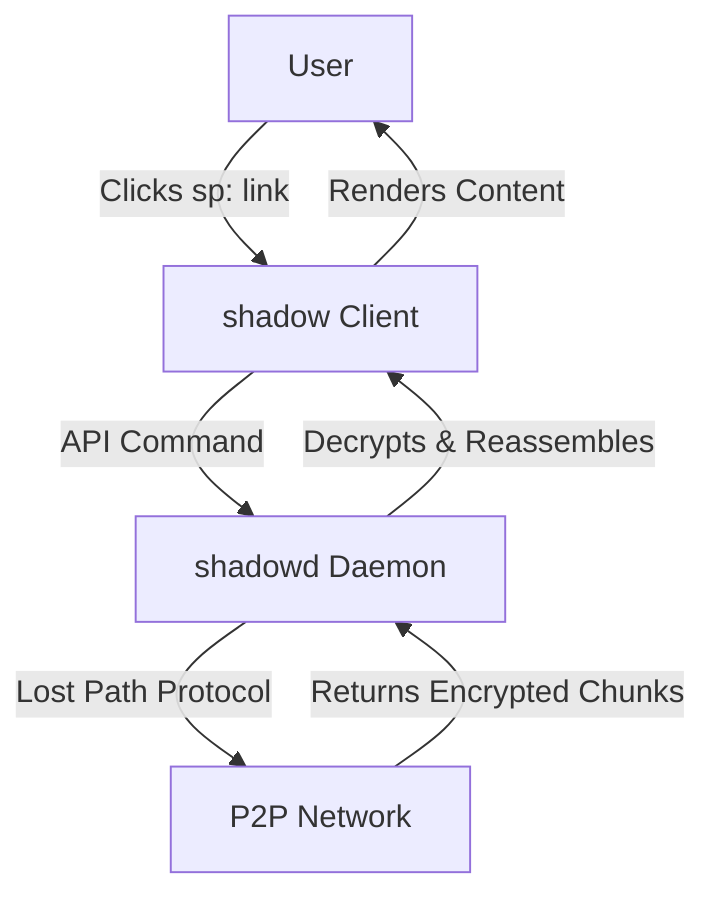

# Shadow-Path: The Sovereign Censorship-Resistant Network


## Vision

Shadow-Path is not just a tool; it is a parallel internet. It is a decentralized, volunteer-operated sovereign network where the only law is cryptography. There is no HTTP, no WWW. The **`sp:` protocol is the only gateway**. Users run a dedicated client application to enter this realm, where they can share files, host websites, and communicate, all built upon a foundation of absolute anonymity and radical decentralization. The network is its users, who donate resources to create an unassailable "shadow" world.

## Core Principles

*   **Sovereign Protocol:** The `sp:` protocol is the exclusive access method. There is no HTTP bridge.
*   **Absolute Privacy:** Zero metadata leakage. No IP logging. Content is unknowable.
*   **Plausible Deniability:** Node operators store only encrypted, indistinguishable data chunks.
*   **Radical Decentralization:** No central servers or authorities. The network is its users.
*   **One Client, One Network:** A dedicated application is the only interface to this world.

## How It Works: The Sovereign Pattern

1.  **Publish:** A user drops content (a file, website, chat message) into the Shadow-Path client.
    *   The client encrypts and shatters the content into chunks.
    *   It distributes these chunks to the "Black Boxes" of volunteers.
    *   It generates a unique key: a **`.path` URL** (e.g., `sp:ax8f...y9z1.path`).

2.  **Share:** The user shares this `.path` URL. **This URL is the secret key.**

3.  **Access:**
    *   Another user clicks the `sp:` link, launching the Shadow-Path client.
    *   The client commands the `shadowd` daemon to find, retrieve, and decrypt the chunks.
    *   The content is rendered **within the client's built-in viewer**—be it a document, website, or chat interface.

## System Architecture: The Pillars

| Component | Purpose |
| :--- | :--- |
| **`shadowd` Daemon** | The core engine. Manages the P2P network, the Black Box, and all crypto operations. |
| **`candle` Client** | The sovereign application. The only interface for viewing, publishing, and interacting with `sp:` content. Includes a built-in renderer. |
| **Lost Path Protocol (LPP)** | The suite of protocols that power the sovereign network (DHT, Mixnet, Tun). |
| **Black Box** | Isolated storage on a volunteer's disk for encrypted chunks. the system will not effected by blackbox, read only by system, write only from "ghost" the user, no one know whats in the blackbox! unless explored by the candle |

## Why Shadow-Path? The Sovereign Advantage

| Feature | Regular Internet | Tor / I2P | **Shadow-Path** |
| :--- | :--- | :--- | :--- |
| **Protocol** | HTTP/S | HTTP/S over anonymity layers | **`sp:` (Sovereign)** |
| **Access Client** | Browser | Browser + Proxy | **Dedicated App** |
| **Network Model** | Client-Server | Anonymized Access | **Self-Contained Realm** |
| **Operator Risk** | N/A | Medium (Relay Operator) | **Very High (Plausible Deniability)** |

**Shadow-Path stands alone by being a complete alternative, not an accessory to the old web.**

## Project Roadmap

### Phase 0: Research & Specification (Current Phase)
-   [ ] Finalize the Lost Path Protocol (LPP) specification.
-   [ ] Define the `.path` URL standard.
-   [ ] **Deliverable:** Complete `docs/05-PROTOCOL.md` spec.

### Phase 1: Core Library & CLI (Months 1-4)
-   [ ] Develop `libshadow` in D (crypto, chunking, storage).
-   [ ] **Deliverable:** `shadowt` CLI tool to publish/get files locally.

### Phase 2: The `shadowd` Daemon (Months 5-8)
-   [ ] Implement LPP-DHT for peer discovery.
-   [ ] Build the `shadowd` daemon with systemd integration.
-   [ ] **Deliverable:** A secure daemon that can join a test network.

### Phase 3: The Sovereign `shadow` Client (Months 9-12)
-   [ ] Develop the GUI client with built-in viewer (using WebKitGTK).
-   [ ] Implement `sp:` protocol handler OS integration.
-   [ ] **Deliverable:** A usable alpha where users can browse `.path` sites.

### Phase 4: Ecosystem (Future)
-   [ ] Develop "Lighter" terminal chat.
-   [ ] Enhance protocol performance.

## Getting Started for Developers

1.  **Get Familiar:** Read the `/docs` directory, starting with `01-VISION.md` and `05-PROTOCOL.md`.
2.  **Set Up Your Environment:**
    ```bash
    git clone https://github.com/shadow-path/shadow.git
    cd shadow
    dub build
    ```
3.  **Find an Issue:** Look for issues tagged `good first issue`.

## Documentation

All documentation is in the `/docs` folder. Start with:
*   **[`ARCHITECTURE.md`](docs/02-ARCHITECTURE.md)** - System overview.
*   **[`PROTOCOL.md`](docs/05-PROTOCOL.md)** - **The core spec.**

## License

**GNU Affero General Public License v3.0 (AGPLv3)**.

## Disclaimer

This project is in the early planning and development stages. It is not yet suitable for real-world use.

---

**We are not building another tool. We are building another world.**

### **`docs/01-VISION.md`**

# The Shadow-Path Vision

## What Shadow-Path Is Not

*   It is not a proxy to access the existing internet anonymously.
*   It is not a browser extension or plugin.
*   It does not use HTTP, HTTPS, or any legacy web protocol for its core operation.

## What Shadow-Path Is

Shadow-Path is the foundation for a **sovereign digital commons**. It is a parallel dimension of the internet, built from first principles with censorship resistance, privacy, and user sovereignty as its immutable laws.

*   **A Network:** A true peer-to-peer mesh, where users provide the infrastructure.
*   **A Protocol:** The `sp:` protocol is its native language, used for addressing all content.
*   **An Application:** A dedicated client is the passport to enter and experience this world.

The vision is a future where communities can exist, communicate, and persist digitally on their own terms, untouchable by any central authority. Shadow-Path provides the ground upon which that future can be built.

### **`docs/02-ARCHITECTURE.md`**

# System Architecture

## The Two-Layer Model

Shadow-Path's architecture is split into two main layers:

1.  **The Engine (`shadowd` Daemon):** A headless background process that handles all network and cryptographic operations. It is controlled via a local API.
2.  **The Interface (`shadow` Client):** A graphical application that users interact with. It renders content retrieved by the daemon and sends it commands.

## Component Interaction



## The `sp:` Protocol

The `sp:` URI is the fundamental unit of addressability. Examples:
-   `sp:ax8f...y9z1.path` (A file or website)
-   `sp:chat...cafe.path` (A chat room)
-   `sp:live...stream.path` (A live stream)

The path suffix (e.g., `.path`) is a convention for human readability; the hash is the only identifier the network uses.

## Network Bootstrapping

New nodes connect to the network using hardcoded **Bootstrap Nodes**. These are stable peers run by the core team and early volunteers. After the initial connection, a node discovers other peers through the DHT and becomes a full part of the decentralized swarm.

This architecture ensures the network is both bootstrappable and truly decentralized.
